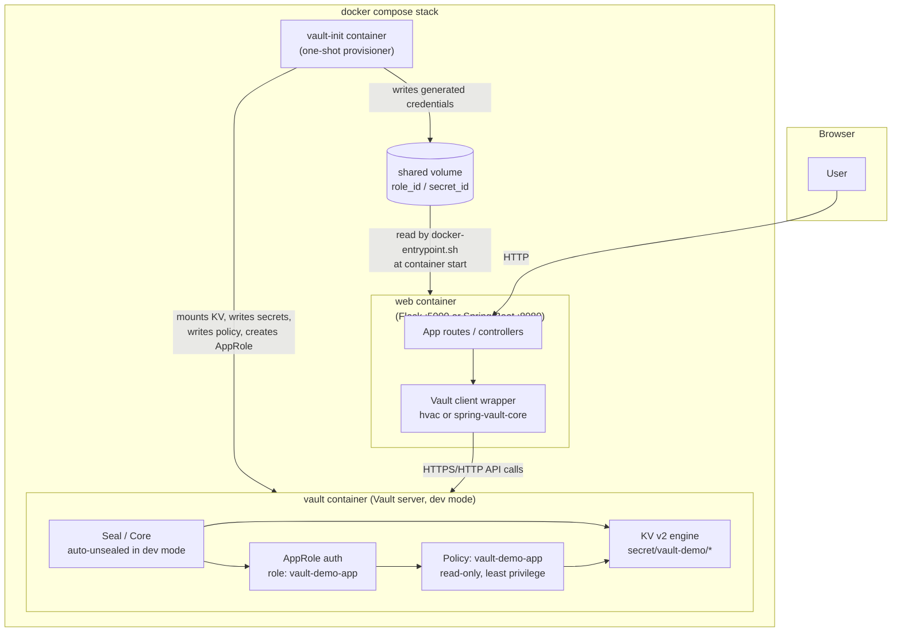

# HashiCorp Vault Project


## Executive Summary

This is a **proof-of-concept / learning project**, not a production system. It
exists to demonstrate, hands-on, how an application integrates with
**HashiCorp Vault** for secrets management: authenticate with AppRole, read
versioned secrets from the KV v2 engine, handle Vault's failure modes
honestly (unreachable, sealed, unauthenticated, forbidden, not found), and
rotate a secret with zero application downtime.

The same scenario is implemented **twice, independently**, in two different
stacks that run side by side:

| Implementation | Stack | Path |
|---|---|---|
| Primary | Python 3.12 + Flask 3 + [`hvac`](https://github.com/hvac/hvac) | [`vault/`](vault/) |
| Secondary | Java 11 + Spring Boot 2.7 + Spring Vault | [`vault/vault-spring-boot/`](vault/vault-spring-boot/) |

The point of building it twice is to show that the *Vault workflow*
(authenticate → read → handle failure → rotate) is the same regardless of
which client library or language wraps it — only the syntax changes.

This repo is deliberately small and self-contained (one Docker Compose stack
per implementation, in-memory dev-mode Vault, fake sample secrets). It is
meant to be read end-to-end, not deployed as-is.

## Key Capabilities Demonstrated

- **AppRole authentication** — machine identity via `role_id`/`secret_id`, the realistic pattern for a service (vs. a human).
- **KV v2 secrets engine** — static secrets with version history, read via `secret/data/<path>`.
- **Least-privilege policy** — an HCL policy granting `read` only on this app's own secret paths, nothing else.
- **Zero-downtime secret rotation** — `vault kv put` a new version, the app picks it up on the next request with no restart.
- **Honest failure handling** — four distinct exception types (connection / auth / permission / not-found) surfaced to the UI instead of a generic 500.
- **Init/unseal workflow** — a separate script (`production-mode-demo.sh`) spins up a *non*-dev Vault server so you can practice `vault operator init`/`unseal` by hand (the default docker-compose stack uses Vault dev mode, which skips this on purpose, for low-friction onboarding).
- **Two independent client implementations** of the exact same scenario (`hvac` in Python, `spring-vault-core` in Java) for side-by-side comparison.
- **Kubernetes reference manifest** (not deployed) showing the same secrets reaching a pod via the Vault Agent Injector sidecar instead of the docker-compose `vault-init` pattern.

## Architecture

Both implementations follow the same three-service Docker Compose shape,
differing only in ports and the `web` container's language runtime:



Sequence for a page load (e.g. `/secrets`): the app authenticates to Vault
once (AppRole login, cached), then issues an authenticated `GET` against the
KV v2 `data/` path for each secret, and renders whatever comes back — nothing
is cached or stored locally by the app itself. The full byte-level
request/response trace is in
[`vault/docs/04-vault-integration.md`](vault/docs/04-vault-integration.md#complete-requestresponse-flow).

## Repository Layout

```
hashicorp-vault-project/
├── LICENSE
├── README.md                      This file
└── vault/                         Primary implementation: Python + Flask
    ├── app.py                     Flask routes (/, /secrets, /vault-info, /health)
    ├── config.py                  Env-var configuration (+ .env loading)
    ├── vault_client.py            The only module that imports hvac
    ├── docker-entrypoint.sh       Loads AppRole creds from a shared volume before starting Flask
    ├── requirements.txt / Dockerfile / docker-compose.yml
    ├── templates/, static/        Jinja2 HTML + Bootstrap CSS/JS
    ├── vault/
    │   ├── policies/app-policy.hcl        Least-privilege HCL policy
    │   ├── scripts/                       Numbered, individually runnable Vault setup steps
    │   └── production-demo/config.hcl     Config for the manual init/unseal demo
    ├── k8s-examples/               Reference-only Kubernetes + Vault Agent Injector manifest
    ├── docs/                       Full 8-part documentation set (see below)
    └── vault-spring-boot/          Secondary implementation: Java + Spring Boot + Spring Vault
        ├── pom.xml, Dockerfile, docker-compose.yml
        ├── src/main/java/...       Controllers, VaultService, config, exceptions
        ├── src/main/resources/     application.yml, Thymeleaf templates, static assets
        └── vault/                  Same policy/scripts pattern as the Python project
```

Two READMEs already live one level down and are the real depth of this
project:

| Doc | Covers |
|---|---|
| [`vault/README.md`](vault/README.md) | Quick start, project structure, learning scenarios for the Python/Flask implementation |
| [`vault/vault-spring-boot/README.md`](vault/vault-spring-boot/README.md) | What's specific to the Spring Vault implementation |
| [`vault/docs/`](vault/docs/) | 8-document deep dive: overview, dev setup, application walkthrough, **Vault integration (primary focus)**, Vault setup, deployment, DevOps perspective, appendices/FAQ/glossary |

This root README is the entry point across both stacks; it does not
duplicate that material.

## Tech Stack

| Layer | Choice | Notes |
|---|---|---|
| Secret store | HashiCorp Vault 1.17 | Runs in **dev mode** by default (in-memory, auto-unsealed) |
| Primary app | Python 3.12, Flask 3.0.3, `hvac` 2.3.0 | [`vault/`](vault/) |
| Secondary app | Java 11, Spring Boot 2.7.18, `spring-vault-core` 2.3.4 | [`vault/vault-spring-boot/`](vault/vault-spring-boot/) |
| Templating | Jinja2 (Flask) / Thymeleaf (Spring Boot) | Server-rendered, no frontend build step |
| Styling | Bootstrap 5 (CDN) | No custom frontend framework |
| Containerization | Docker + Docker Compose | Each implementation is a self-contained 3-service stack |
| WSGI server (prod-only option) | Gunicorn | In `requirements.txt`, not used by the default dev container |

## Quick Start

Requirements: Docker + Docker Compose. Each implementation is fully
self-contained and runs on different host ports, so both can run at the same
time without colliding.

**Python/Flask implementation:**
```bash
cd vault
docker compose up -d --build
```
Open `http://localhost:5000/` (app) and `http://localhost:8200/ui` (Vault UI, token `root`).

**Java/Spring Boot implementation:**
```bash
cd vault/vault-spring-boot
docker compose up -d --build
```
Open `http://localhost:8080/` (app) and `http://localhost:8300/ui` (Vault UI, token `root`).

Each `docker compose up` starts three containers: `vault` (dev-mode Vault
server), `vault-init` (one-shot job that provisions the KV engine, sample
secrets, policy, and AppRole role, then exits), and `web` (the application,
which waits for `vault-init` to finish and reads its generated AppRole
credentials from a shared volume before starting).

Full prerequisites, hybrid (non-Docker) local dev instructions, and
verification steps are in
[`vault/docs/02-development-setup.md`](vault/docs/02-development-setup.md).

## Configuration

Both apps read all non-secret configuration from environment variables, with
safe local-dev defaults so `docker compose up` works out of the box.
Full reference tables:
[Python](vault/docs/08-appendices.md#configuration-reference-environment-variables) ·
[Spring Boot](vault/vault-spring-boot/README.md#configuration).

The two variables that matter most:

| Variable (Python) / Property (Spring Boot) | Meaning |
|---|---|
| `VAULT_ADDR` / `APP_VAULT_ADDRESS` | Vault server URL |
| `VAULT_AUTH_METHOD` / `APP_VAULT_AUTH_METHOD` | `approle` (default, used by the Docker stack) or `token` (simpler, for local experimentation with the dev-mode root token) |

## Usage Examples

Walk through the UI: **Home** (Vault reachability/seal/auth status) →
**Secrets** (three example secrets fetched live from Vault, with a
Show/Hide toggle) → **Vault Info** (live token TTL and attached policies).

**Rotate a secret with zero app downtime** (the single demo this whole
project is built around):
```bash
# Python stack
docker exec -e VAULT_TOKEN=root vault-demo-server sh /vault-config/scripts/rotate-secret-demo.sh

# Spring Boot stack
docker exec -e VAULT_TOKEN=root vault-demo-server-java sh /vault-config/scripts/rotate-secret-demo.sh
```
Reload `/secrets` — the database password has changed, with no code change
and no restart.

**Practice Vault's init/unseal workflow** by hand, against a separate,
throwaway, non-dev server:
```bash
sh vault/vault/scripts/production-mode-demo.sh
```

More scenarios (token expiry, simulated access-denied) are listed in both
sub-READMEs and detailed in
[`vault/docs/04-vault-integration.md`](vault/docs/04-vault-integration.md) and
[`vault/docs/07-devops-perspective.md`](vault/docs/07-devops-perspective.md).

## Security Considerations

This project is intentionally transparent about what it does *not* do
safely, because that gap is itself part of the lesson:

- **Dev-mode Vault, hardcoded root token (`root`).** Fine for a local
  learning container; never appropriate outside one. The
  [`production-mode-demo.sh`](vault/vault/scripts/production-mode-demo.sh)
  script exists specifically to show the real init/unseal flow that dev
  mode skips.
- **In-memory storage.** Dev mode's Vault data (secrets, policies, the
  AppRole role itself) is lost on every container restart; there is nothing
  to back up in this configuration.
- **`tls_disable = "true"`** everywhere in this repo, including the
  "production-mode" demo config — acceptable only because every Vault
  instance here is a throwaway, localhost-only container. A real deployment
  always terminates TLS.
- **AppRole with unlimited `secret_id` uses** (`secret_id_num_uses=0`) and a
  4-hour max token TTL — deliberately generous for a learning environment;
  production roles should be tighter and scoped per instance/environment.
- **Sample secrets are fake by design** (`SuperS3cretDbPass!`,
  `demo-api-key-12345`, etc.), written in plain sight in
  [`02-create-secrets.sh`](vault/vault/scripts/02-create-secrets.sh) — safe
  to commit precisely because they're not real. Never follow this pattern
  with actual credentials.
- **Least-privilege policy is real, not just described.** `app-policy.hcl`
  grants exactly `read` on this app's own KV paths — verified in
  `vault_client.py`/`VaultService.java`'s permission-denied handling paths.
- **No audit device enabled** by default (would log every request/response)
  and no automated secret scanning/dependency scanning configured in this
  repo — see Known Issues below.
- A dedicated secret scan was run over this repository while writing this
  documentation; no real (non-fake, non-placeholder) credentials were found
  committed to git history.

## Troubleshooting / FAQ

The most common issue by far: **dev-mode Vault is in-memory, so restarting
the `vault` container invalidates any AppRole credentials the `web`
container already loaded.** Fix: `docker compose restart web` (or, for the
Java stack, the equivalent `vault-demo-web-java` container).

For the full troubleshooting tables, CLI cheat sheet, and glossary, see
[`vault/docs/08-appendices.md`](vault/docs/08-appendices.md). Both
implementations share the same failure modes — the Spring Boot app just
reports them via Java stack traces where the Python app raises its own
`Vault*Error` exceptions.

## Known Issues / Recommendations

- **Fixed during this documentation pass:** `vault/.gitignore` had been
  accidentally renamed to `vault/gitignore` (missing leading dot) in the
  second commit of this repo's history, silently disabling it. As a direct
  result, two compiled `__pycache__/*.pyc` files had been committed to git.
  Both are fixed here: the file is renamed back to `.gitignore` and the
  stray `.pyc` files are removed from tracking.
- **No automated tests** for either implementation (no `pytest`/`unittest`
  suite for the Flask app, no test classes beyond the unused
  `spring-boot-starter-test` dependency for the Spring Boot app).
- **No CI/CD.** There is no `.github/workflows` directory — builds, lint,
  and the manual verification steps in the docs are not automated. This is
  why no CI status badge appears above.
- **No dependency/secret scanning** wired into the repo (e.g. Dependabot,
  `pip-audit`, `trivy`) — worth adding if this repo is used as a template
  for anything beyond learning.
- **Java stack pins Spring Boot 2.7.18 / JDK 11**, an aging (though still
  supported) combination — fine for demonstrating Spring Vault, but a
  newer LTS (Java 17/21, Spring Boot 3.x) would be more representative of
  a current codebase if this project is extended.
- **`hvac.Client(...)` in `vault_client.py` has no `verify=` parameter** for
  a custom CA bundle — noted in the docs themselves
  ([`06-deployment.md`](vault/docs/06-deployment.md#connecting-the-application-to-vault))
  as something to add before pointing this code at a real, TLS-terminated
  Vault.
- **No root-level `.gitignore`** — each sub-project has its own
  (`vault/.gitignore`, `vault/vault-spring-boot/.gitignore`), which is
  sufficient today since all project content lives under `vault/`, but
  would need revisiting if more top-level projects are added to this repo.

## Status & Roadmap

This project is a **complete, working learning environment** for both
stacks — the documentation set, Docker Compose stacks, and Vault
provisioning scripts all match what's actually implemented, verified file
by file while writing this documentation.

What's honestly unfinished or out of scope, based on gaps visible in the
code itself:

- No CI pipeline, no automated tests (see Known Issues above).
- No Infrastructure-as-Code (Terraform) for Vault configuration — the docs
  describe this as the real-world approach but the repo itself only ships
  the equivalent shell scripts.
- No dynamic secrets engine example (Database, AWS, PKI) — only static
  KV v2, explicitly noted as a simplification in
  [`vault/docs/04-vault-integration.md`](vault/docs/04-vault-integration.md#dynamic-secrets).
- No TLS demonstration anywhere in the repo (all three Vault configs used
  here disable it).
- The Kubernetes manifest in `k8s-examples/` is reference-only and has
  never been deployed to a real cluster as part of this project.

---

Questions about the Vault concepts themselves belong in
[`vault/docs/04-vault-integration.md`](vault/docs/04-vault-integration.md) —
start there.
