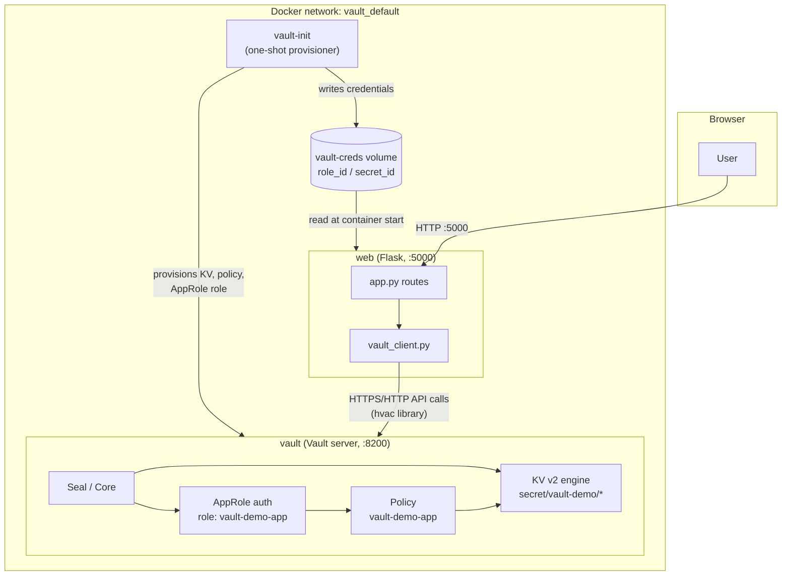
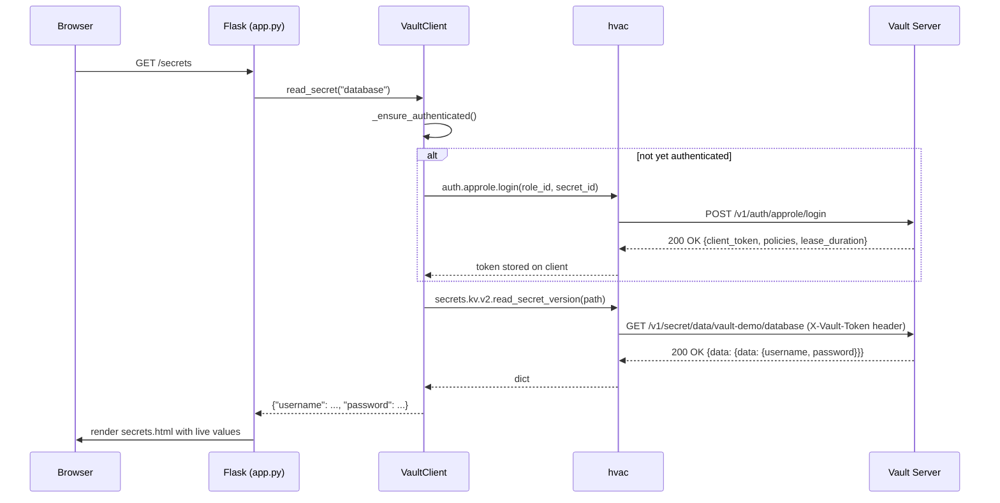

# 1. Project Overview

[← Back to README](../README.md)

## What This Project Is

A minimal Flask application whose only real feature is asking HashiCorp
Vault for secrets instead of storing them itself. Everything else (the
UI, the routes, the Docker setup) exists to make that one idea concrete
and clickable.

## Architecture



## Components and Responsibilities

| Component | Responsibility |
|---|---|
| `web` (Flask + `app.py`) | Serves the UI, orchestrates calls to Vault, never persists a secret |
| `vault_client.py` | The only module that imports `hvac`; owns authentication, error translation |
| `config.py` | Reads non-secret configuration from environment variables / `.env` |
| `vault` (Vault server) | Stores secrets (KV v2), authenticates the app (AppRole), authorizes reads (policy) |
| `vault-init` | One-shot provisioning job: mounts the KV engine, writes sample secrets, writes the policy, enables AppRole, generates credentials |
| `vault-creds` volume | Hand-off point between `vault-init` and `web` for the generated AppRole `role_id`/`secret_id` |
| `templates/`, `static/` | Server-rendered Jinja2 HTML + Bootstrap styling + a small JS show/hide toggle |

## Technology Stack

| Layer | Choice | Why |
|---|---|---|
| Language | Python 3.12 | Wide `hvac` support, simple syntax for a learning project |
| Web framework | Flask 3 | Minimal, explicit routing, easy to read top-to-bottom |
| Templating | Jinja2 (via Flask) | Server-side rendering, no frontend build step needed |
| Styling | Bootstrap 5 (CDN) | Presentable UI without writing custom CSS |
| Vault client | `hvac` 2.x | The de-facto Python client for Vault's HTTP API |
| Secret store | HashiCorp Vault 1.17 (dev mode) | The subject of the project |
| Containerization | Docker + Docker Compose | Reproducible, one-command environment |
| WSGI server (prod option) | Gunicorn | See [Deployment](06-deployment.md) — not used in the default dev container |

## Folder Structure

```
vault/
├── app.py                    Flask routes
├── config.py                 Env-var based configuration (+ .env loading)
├── vault_client.py           hvac wrapper: auth, reads, error translation
├── docker-entrypoint.sh      Loads AppRole creds from a file before starting Flask
├── requirements.txt
├── Dockerfile
├── docker-compose.yml        vault + vault-init + web
├── .env.example               Template for local (non-Docker) runs
│
├── templates/                 Jinja2 HTML
├── static/                    CSS + JS
│
├── vault/
│   ├── policies/app-policy.hcl
│   ├── scripts/                Numbered, individually runnable setup steps
│   └── production-demo/        Config for the standalone init/unseal demo
│
├── k8s-examples/               Reference-only Kubernetes manifest
│
└── docs/                       This documentation set
```

## Data Flow: Loading the Secrets Page



Full byte-level detail of this flow (including the exact HTTP requests
`hvac` issues) is in
[04-vault-integration.md](04-vault-integration.md#complete-requestresponse-flow).

## Where To Go Next

- New to the project? Start with [02-development-setup.md](02-development-setup.md).
- Want to understand the app itself? [03-application.md](03-application.md).
- Here for Vault specifically? [04-vault-integration.md](04-vault-integration.md) is the primary/deepest document.
