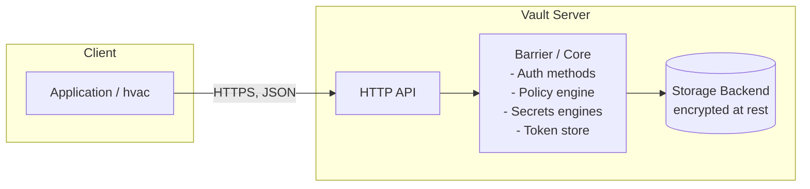

# 4. HashiCorp Vault Integration (Primary Focus)

[← Back to README](../README.md)

This is the deepest document in this repo. If you only read one file to
prepare for a Vault-related interview or task, read this one.

## Table of Contents
- [What Is Vault, and Why Do Organizations Use It](#what-is-vault-and-why-do-organizations-use-it)
- [Vault Architecture](#vault-architecture)
- [Vault Components](#vault-components)
- [How the Application Communicates with Vault](#how-the-application-communicates-with-vault)
- [Authentication Methods Used by the Application](#authentication-methods-used-by-the-application)
- [How Secrets Are Stored (KV v2)](#how-secrets-are-stored-kv-v2)
- [How Secrets Are Retrieved](#how-secrets-are-retrieved)
- [Secret Rotation](#secret-rotation)
- [Dynamic Secrets](#dynamic-secrets)
- [Vault Policies and Access Control](#vault-policies-and-access-control)
- [Token Lifecycle](#token-lifecycle)
- [Lease Management](#lease-management)
- [Complete Request/Response Flow](#complete-requestresponse-flow)
- [Every Vault Configuration Used in This Project](#every-vault-configuration-used-in-this-project)
- [Security Best Practices](#security-best-practices)
- [Troubleshooting](#troubleshooting)

---

## What Is Vault, and Why Do Organizations Use It

HashiCorp Vault is a system for **centrally storing, tightly controlling
access to, and optionally dynamically generating** secrets: database
credentials, API keys, TLS certificates, encryption keys, cloud IAM
credentials.

Organizations adopt it to solve problems that get worse, not better, as
they scale:

- **Secret sprawl** — without Vault, credentials end up copy-pasted
  across config files, CI variables, wikis, and Slack DMs, with no single
  place to audit or revoke them.
- **No expiry** — a hardcoded or env-var secret is valid until someone
  remembers to change it, often years.
- **No audit trail** — "who read the production DB password, and when?"
  is unanswerable without a system like Vault in front of it.
- **Manual rotation is risky and rare** — if rotating a secret means a
  code change and a deploy, teams avoid doing it, so a single leak stays
  exploitable indefinitely.
- **Every credential is equally powerful** — without per-consumer
  identity, one leaked shared secret compromises everything that used it.

## Vault Architecture



- Vault is a single Go binary that runs as an HTTP(S) API server.
- In production it runs as a **cluster**: one active node handling
  requests, several standby nodes ready to take over (HA via Consul or
  Integrated Storage/Raft).
- The **storage backend** holds only *encrypted* data — Vault's Barrier
  is the only thing that can decrypt it, and only once **unsealed** (see
  below). This project's dev-mode Vault uses **in-memory** storage (data
  is lost on restart) — see [Learning Scenario](#seal-unseal) for a
  file-backed, persistent alternative.

## Vault Components

### Storage Backend
Where encrypted data physically lives: `file`, Consul, Integrated
Storage (Raft, the modern default), or a cloud backend. Vault treats this
as swappable/pluggable — the app never talks to it directly.

### Seal / Unseal
Vault encrypts all data at rest with an encryption key that is itself
encrypted by a **master key**, split into key shares using **Shamir's
Secret Sharing** (default: 5 shares, any 3 reconstruct the key).

- **Sealed** = Vault has the encrypted data on disk but no key in memory
  to decrypt it. A sealed Vault answers almost nothing except
  `status`/`unseal`.
- **Unsealing** = supplying enough key shares (the *threshold*, e.g. 3
  of 5) to reconstruct the master key in memory. Required every time the
  Vault *process* restarts (not per-request).
- **Dev mode auto-unseals** with a single generated key — convenient for
  learning, absolutely not how a real deployment works. Production
  deployments often use **auto-unseal** via a cloud KMS (AWS
  KMS/Azure Key Vault/GCP KMS) so a human doesn't have to manually
  unseal after every restart.
- `vault/scripts/production-mode-demo.sh` in this repo spins up a
  non-dev server specifically so you can run `vault operator init` and
  `vault operator unseal` by hand. <a id="seal-unseal"></a>

### Secrets Engines
Plugins mounted at a path that determine what reading/writing to that
path does. This project uses **KV v2** (static secrets). Others worth
knowing: **Database** (dynamic DB credentials), **AWS/Azure/GCP**
(dynamic cloud credentials), **PKI** (issues short-lived certs, acting as
a CA), **Transit** ("encryption as a service" — your app sends plaintext
to encrypt/decrypt; the key itself never leaves Vault).

### Authentication Methods
How a caller proves identity (see
[Authentication Methods Used by the Application](#authentication-methods-used-by-the-application)
below for the two this project uses, and the wider list).

### Policies
HCL documents listing paths and allowed capabilities
(`read`/`create`/`update`/`delete`/`list`/`deny`). Vault denies by
default — a token can do *nothing* until a policy explicitly grants it.
See [Vault Policies and Access Control](#vault-policies-and-access-control).

### Tokens
The universal credential — every authenticated call to Vault carries a
token. See [Token Lifecycle](#token-lifecycle).

### Leases
A tracked TTL attached to almost everything non-permanent Vault issues
(tokens, dynamic secrets), enabling automatic and manual revocation. See
[Lease Management](#lease-management).

## How the Application Communicates with Vault

The app never speaks raw HTTP to Vault itself — it uses `hvac`, which
wraps Vault's HTTP API in a Python client. Concretely, `vault_client.py`:

```python
self.client = hvac.Client(url=config.VAULT_ADDR, namespace=config.VAULT_NAMESPACE or None)
```

builds the client (no network call yet), then every subsequent method —
`auth.approle.login()`, `secrets.kv.v2.read_secret_version()`,
`auth.token.lookup_self()` — issues one HTTP request under the hood and
raises an `hvac.exceptions.*` subclass on non-2xx responses, which
`vault_client.py` translates into this project's own exception types
(see [03-application.md → Error Handling](03-application.md#error-handling)).

## Authentication Methods Used by the Application

`Config.VAULT_AUTH_METHOD` selects one of two, at runtime, with no code
changes:

**AppRole (default)** — for machine identity. Two credentials:
- `role_id` — like a username. Not secret by itself; safe to bake into a
  config file or CI variable.
- `secret_id` — like a password. **Is** secret. Meant to be short-lived,
  generated per-consumer, delivered by a secure out-of-band channel
  (a CI secret store, a Vault Agent, cloud instance identity) — never
  committed to source control.

```python
self.client.auth.approle.login(role_id=..., secret_id=...)
```
returns a client token, which `hvac` stores on `self.client.token`
automatically.

**Token (fallback, for local experimentation)** — you already hold a
valid token (e.g. the dev-mode root token) and just set it directly:
```python
self.client.token = self.config.VAULT_TOKEN
```
No login round-trip, but also nothing proves *this specific app
instance's* identity — anyone holding the same string has the same
access. Fine for a single developer's laptop, wrong for anything else.

Methods this project doesn't implement but are worth knowing for
interviews: **Kubernetes** (a pod's own ServiceAccount JWT proves
identity — no secret to distribute at all, see
[Vault with Kubernetes](07-devops-perspective.md#vault-with-kubernetes)),
**AWS IAM** (an EC2 instance/Lambda's cloud identity proves identity),
**OIDC/LDAP/Userpass** (for human operators, not services).

## How Secrets Are Stored (KV v2)

The KV v2 engine, mounted at `secret/`, stores JSON key/value data at a
path and keeps **version history**. Two distinct sub-paths matter:

- `secret/data/<path>` — the actual secret **values**. Reads/writes go
  here.
- `secret/metadata/<path>` — version history, timestamps, deletion
  status. No secret values live here — this is why the policy in this
  project grants `list`/`read` on metadata but only `read` on data (see
  `vault/policies/app-policy.hcl`).

`hvac` hides this distinction for you — `client.secrets.kv.v2.read_secret_version(path="vault-demo/database")`
internally requests `GET /v1/secret/data/vault-demo/database`.

This project stores three **static** secrets (values a human/script
chose, that Vault just stores and versions):
```bash
vault kv put secret/vault-demo/database username="app_db_user" password="SuperS3cretDbPass!"
vault kv put secret/vault-demo/api api_key="demo-api-key-12345" api_secret="demo-api-secret-67890"
vault kv put secret/vault-demo/config environment="development" region="us-east-1" feature_flag="true"
```

## How Secrets Are Retrieved

`vault_client.py`'s `read_secret()`:
```python
def read_secret(self, relative_path):
    self._ensure_authenticated()
    full_path = f"{self.config.VAULT_SECRET_PATH}/{relative_path}"
    response = self.client.secrets.kv.v2.read_secret_version(
        path=full_path,
        mount_point=self.config.VAULT_MOUNT_POINT,
        raise_on_deleted_version=True,
    )
    return response["data"]["data"]
```
Note the double `["data"]["data"]` — KV v2's response envelope wraps the
secret's own `data` object inside a response-level `data` object
(the outer one also carries `metadata` like `version`, `created_time`).
This nesting is the single most common `hvac`/KV-v2 gotcha.

## Secret Rotation

```bash
docker exec -e VAULT_TOKEN=root vault-demo-server sh /vault-config/scripts/rotate-secret-demo.sh
```

`vault kv put` on an existing path doesn't overwrite in place — it writes
a new **version**. Reload `/secrets` in the browser: the app reads
"whatever the current version is" every request, so the new password
appears immediately, with **zero app code changes and zero restart**.
This is the entire value proposition of centralized secret management in
one demo. `vault kv metadata get secret/vault-demo/database` shows the
full version history.

## Dynamic Secrets

Not used by this project's KV engine (which only stores what you give
it), but essential to understand: engines like **Database**, **AWS**,
and **PKI** *generate* a brand-new, unique credential the moment
something requests one, attach a **lease** (TTL) to it, and can revoke it
automatically when the lease expires or on demand. Nobody — not even the
requester — chose that value ahead of time, and it's revocable instantly
without touching the underlying system's shared "root" credential. A
production version of this project's database secret would very likely
use the **Database secrets engine** instead of static KV, generating a
unique, expiring DB user per app instance.

| | Static (this project's KV) | Dynamic |
|---|---|---|
| Who creates the value | A human/script, ahead of time | Vault, at request time |
| Lifetime | Until manually rotated | Has a lease; auto-expires |
| Blast radius of a leak | Shared credential, whole team/app affected | Unique per consumer, naturally time-boxed |

## Vault Policies and Access Control

`vault/policies/app-policy.hcl`:
```hcl
path "secret/data/vault-demo/*" {
  capabilities = ["read"]
}
path "secret/metadata/vault-demo/*" {
  capabilities = ["read", "list"]
}
```
Vault's authorization model is **deny by default, allow-list on top** —
this token can do exactly these two things and nothing else: not write,
not delete, not read any other app's secrets, not manage auth methods.
This is the Principle of Least Privilege made literal and enforced by the
server, not by convention.

A **role** (AppRole's `vault-demo-app` role, in this case) is what binds
an *identity* to one or more *policies*:
```bash
vault write auth/approle/role/vault-demo-app token_policies="vault-demo-app" ...
```
Anyone who successfully authenticates as this role receives a token with
this policy attached.

## Token Lifecycle

1. **Creation** — issued on any successful login (AppRole login, `vault
   token create`, human login via OIDC/LDAP/userpass). Carries policies,
   a TTL, and metadata.
2. **Use** — sent as the `X-Vault-Token` HTTP header on every request;
   `hvac` manages this header for you once set.
3. **Renewal** — a renewable token's TTL can be extended before it
   expires (`vault token renew`), up to its `max_ttl`. This project's
   AppRole role sets `token_ttl=1h`, `token_max_ttl=4h`.
4. **Expiry/Revocation** — once the TTL lapses (or the token/its parent
   is explicitly revoked), it stops working immediately, cluster-wide.
   `vault_client.py`'s `_ensure_authenticated()` calls
   `client.is_authenticated()` before every operation specifically so an
   expired token triggers a fresh login rather than a confusing 403 deep
   in application logic.

Inspect the current token live at
[`/vault-info`](03-application.md#vault-info-vault-info) in this app, or
via `vault token lookup` on the CLI.

## Lease Management

Every dynamic secret and most tokens come with a **lease** — an entry
Vault tracks so it knows when (and how) to revoke what it issued.
```bash
vault lease revoke <lease_id>     # revoke one specific lease
vault lease renew <lease_id>      # extend before it expires
```
Revoking a *token* automatically revokes every lease created using that
token — this is how an incident responder can cut off one compromised
service instance's access to everything it touched, in one command,
without hunting down every individual credential it was handed.

## Complete Request/Response Flow

Byte-level version of the sequence diagram in
[01-project-overview.md](01-project-overview.md#data-flow-loading-the-secrets-page).

**Step 1 — AppRole login** (`hvac` issues this on your behalf):
```
POST /v1/auth/approle/login
Content-Type: application/json

{"role_id": "1e3f...", "secret_id": "9c2a..."}
```
Response:
```json
{
  "auth": {
    "client_token": "hvs.CAESI...",
    "policies": ["default", "vault-demo-app"],
    "lease_duration": 3600,
    "renewable": true
  }
}
```
`hvac` extracts `auth.client_token` and stores it as `client.token`.

**Step 2 — Read a secret**, using that token:
```
GET /v1/secret/data/vault-demo/database
X-Vault-Token: hvs.CAESI...
```
Response:
```json
{
  "data": {
    "data": {"username": "app_db_user", "password": "SuperS3cretDbPass!"},
    "metadata": {"version": 2, "created_time": "2026-07-25T10:48:44Z", ...}
  }
}
```
`vault_client.read_secret()` returns `response["data"]["data"]` — just
the inner values, discarding the version metadata (available separately
via `kv.v2.read_secret_metadata` if needed).

**Failure case — permission denied:**
```
GET /v1/secret/data/some-other-app/database
X-Vault-Token: hvs.CAESI...
```
```
HTTP/1.1 403 Forbidden
{"errors": ["permission denied"]}
```
`hvac` raises `hvac.exceptions.Forbidden`, which `vault_client.py`
catches and re-raises as `VaultPermissionDeniedError`.

## Every Vault Configuration Used in This Project

See [05-vault-setup.md](05-vault-setup.md) for the full command-by-command
walkthrough of `vault/scripts/*.sh` (KV engine mount, secrets, policy,
AppRole role) — that document is the "how do I set this up from
scratch" companion to this one's "how/why does it work."

## Security Best Practices

- Narrowest policy that works — never `path "secret/*" { capabilities = ["read"] }` when `path "secret/data/my-app/*"` is what's actually needed.
- Short TTLs on tokens and `secret_id`s; design clients (like this one)
  to re-authenticate rather than hold a long-lived token.
- Treat `secret_id` and tokens as fully secret; `role_id` as merely
  non-public. Never commit either.
- Prefer dynamic secrets engines over static KV wherever the target
  system supports it — nothing to remember to rotate.
- Enable an **audit device** (`vault audit enable file file_path=...`)
  in any real deployment — every request/response, hashed, for
  compliance and incident response.
- Use TLS between every client and Vault (`tls_disable = "true"` in
  `vault/production-demo/config.hcl` is only acceptable there because
  it's a throwaway localhost-only demo container).

## Troubleshooting

See [08-appendices.md](08-appendices.md#common-errors-and-fixes) for the
full table; the two most common issues while working through this
project specifically:

- **AppRole login fails after restarting the `vault` container** — dev
  mode is in-memory; a restart wipes the AppRole role entirely, so
  `vault-init` provisions a *new* `role_id`/`secret_id` pair, and any
  already-running `web` container is still holding the old one. Fix:
  `docker compose restart web`.
- **"Permission denied" reading a secret that clearly exists** — the
  token authenticated fine, but its attached policy doesn't grant that
  exact path (remember the `secret/data/...` vs `secret/metadata/...`
  split). `vault token lookup` shows attached policies;
  `vault policy read <name>` shows what they actually grant.
